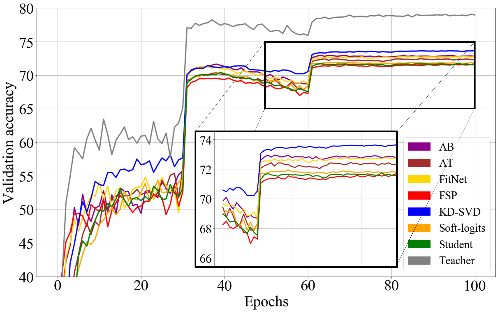

# Knowledge Distillation Methods with Tensorflow
Knowledge distillation is the method to enhance student network by teacher knowledge.
So annually knowledge distillation methods have been proposed, but each paper's do experiments with different networks and compare with different methods.
Moreover, each method is implemented by each author, so if a new researcher wants to study knowledge distillation, they have to find or implement all of the methods. Surely it is tough work.
To reduce this burden, I publish some codes and modify from my research codes.
I'll update the code and knowledge distillation algorithm, and all of the things will be implemented using Tensorflow.

# Implemented Knowledge Distillation Methods
Please check detail of each category in [MHGD](https://arxiv.org/abs/1907.02226) and If you think the above categorization is useful, please consider citing the following paper.

    @inproceedings{GraphKD,
      title = {Graph-based Knowledge Distillation by Multi-head Attention Network},
      author = {Seunghyun Lee, Byung Cheol Song},
      booktitle = {British Machine Vision Conference (BMVC)},
      year = {2019}
    }

## Response-based Knowledge
Defined knowledge by the neural response of the hidden layer or the output layer of the network
- Soft-logit : The first knowledge distillation method for deep neural network. Knowledge is defined by softened logits. Because it is easy to handle it, many applied methods were proposed using it such as semi-supervised learning, defencing adversarial attack and so on.
  - [Geoffrey Hinton, et al. Distilling the knowledge in a neural network. arXiv:1503.02531, 2015.](https://arxiv.org/abs/1503.02531)
- Deep Mutual Learning (DML) : train teacher and student network coincidently, to follow not only training results but teacher network's training procedure.
  - [Zhang, Ying, et al. "Deep mutual learning." Proceedings of the IEEE Conference on Computer Vision and Pattern Recognition. 2018.](http://openaccess.thecvf.com/content_cvpr_2018/html/Zhang_Deep_Mutual_Learning_CVPR_2018_paper.html)\
- Factor Transfer (FT) : Encode a teacher network's feature map, and transfer the knowledge by mimicking it.
  - [Jangho Kim et al. "Paraphrasing Complex Network: Network Compression via Factor Transfer" Advances in Neural Information Processing Systems (NeurIPS) 2018](https://papers.nips.cc/paper/7541-paraphrasing-complex-network-network-compression-via-factor-transfer)

## Multi-connection Knowledge
Increases knowledge by sensing several points of the teacher network
- FitNet : To increase amounts of information, knowledge is defined by multi-connected networks and compared feature maps by L2-distance.
  - [Adriana Romero, et al. Fitnets: Hints for thin deep nets. arXiv preprint arXiv:1412.6550, 2014.](https://arxiv.org/abs/1412.6550)
- Attention transfer (AT) : Knowledge is defined by attention map which is L2-norm of each feature point.
  - [Zagoruyko, Sergey et. al. Paying more attention to attention: Improving the performance of convolutional neural networks via attention transfer. arXiv preprint arXiv:1612.03928, 2016.](https://arxiv.org/pdf/1612.03928.pdf)
- Activation boundary (AB) : To soften teacher network's constraint, they propose the new metric function inspired by hinge loss which usually used for SVM.
  - [Byeongho Heo, et. al. Knowledge transfer via distillation of activation boundaries formed by hidden neurons. AAAI2019](https://arxiv.org/abs/1811.03233) (rivised by Author)

## Shared-representation Knowledge
Defined knowledge by the relation between two feature maps
- Flow of Procedure (FSP) : To soften teacher network's constraint, they define knowledge as relation of two feature maps.
  - [Junho Yim, et. al. A gift from knowledge distillation:
Fast optimization, network minimization, and transfer learning. CVPR 2017.](http://openaccess.thecvf.com/content_cvpr_2017/html/Yim_A_Gift_From_CVPR_2017_paper.html)
- KD using Singular value decomposition(KD-SVD) : To extract major information in feature map, they use singular value decomposition.
  - [Seung Hyun Lee, et. al. Self-supervised knowledge distillation using singular value decomposition. ECCV 2018](http://openaccess.thecvf.com/content_ECCV_2018/html/SEUNG_HYUN_LEE_Self-supervised_Knowledge_Distillation_ECCV_2018_paper.html)

## Relational Knowledge
Defined knowledge by intra-data relation
- Relational Knowledge Distillation (RKD): they propose knowledge which contains not only feature information but also intra-data relation information.
  - [Wonpyo Park, et. al. Relational Knowledge Distillation. CVPR2019](https://arxiv.org/abs/1904.05068?context=cs.LG)
- Multi-head Graph Distillation (MHGD): They proposed the distillation module which built with the multi-head attention network. 
Each attention-head extracts the relation of feature map which contains knowledge about embedding procedure.
  - [Seunghyun Lee, Byung Cheol Song. Graph-based Knowledge Distillation by Multi-head Self-attention Network. will be published in BMVC2019](https://arxiv.org/abs/1907.02226)
  
# Experimental Results
The below table and plot are sample results using [ResNet](http://openaccess.thecvf.com/content_cvpr_2016/html/He_Deep_Residual_Learning_CVPR_2016_paper.html) and train on CIFAR100.

I use the same hyper-parameter for training each network, and only tune hyper-parameter of each distillation algorithm. However the results may be not optimal. All of the numerical values and plots are averages of five trials.

## Network architecture
The teacher network is ResNet32 and Student is ResNet8, and the student network is well-converged (not over and under-fit) for evaluating each distillation algorithm performance precisely. Note that implemented ResNet has doubled depth.

## Training/Validation accuracy

Methods | Last Accuracy | Best Accuracy
------------| ------------- | -------------
Student     | 71.76 | 71.92 
Teacher     | 78.96 | 79.08 
Soft-logits | 71.79 | 72.08 
FitNet      | 72.74 | 72.96
AT          | 72.31 | 72.60
FSP         | 72.65 | 72.91
DML         | 73.27 | 73.47
KD-SVD      | 73.68 | 73.78
KD-EID      | 73.84 | 74.07
FT          | 73.35  | 73.50
AB          | 73.08 | 73.41
RKD         | 73.40 | 73.48
MHGD        | 73.98 | 74.30

# Plan to do
- Upload Factor Transfer (Final check is on going :))
